# 🤖 Agentic RAG Pipeline

A powerful Retrieval-Augmented Generation (RAG) system built with **LangGraph**, **FastAPI**, and **Qdrant Cloud**. This project provides an intelligent document processing and question-answering system that can ingest PDFs and other documents, then answer questions using advanced AI techniques.

[](https://python.org)
[](https://fastapi.tiangolo.com)
[](https://langchain-ai.github.io/langgraph/)
[](LICENSE)

## ✨ Features

- 🚀 **Fast Document Ingestion**: Upload PDFs and other documents via REST API
- 🧠 **Intelligent RAG Pipeline**: LangGraph-powered multi-step retrieval and generation
- 🔍 **Advanced Vector Search**: Qdrant Cloud integration for efficient similarity search
- 🌐 **RESTful API**: Clean FastAPI endpoints for easy integration
- 📄 **Multi-format Support**: PDF, TXT, MD, HTML, DOCX document processing
- 🔧 **Configurable**: Flexible chunking, embedding, and generation parameters
- ☁️ **Cloud-Ready**: Built for production with Qdrant Cloud and OpenAI

## 🏗️ Architecture

```mermaid
graph TB
    A[📄 Documents] --> B[🔧 Document Processor]
    B --> C[📊 Vector Store<br/>Qdrant Cloud]
    C --> D[🔍 LangGraph RAG Pipeline]
    D --> E[🤖 OpenAI LLM]
    E --> F[💬 Answer]
    
    G[🌐 FastAPI] --> H[📤 /ingest]
    G --> I[❓ /query]
    H --> B
    I --> D
```



## 🚀 Quick Start

### Prerequisites

- Python 3.9+
- OpenAI API key
- Qdrant Cloud account (free tier available)

### 1. Installation

```bash
# Clone the repository
git clone https://github.com/yourusername/agentic-rag-pipeline.git
cd agentic-rag-pipeline/app

# Install dependencies
pip install -e .

# Copy environment template
cp env.example .env
```

### 2. Configuration

Edit your `.env` file:

```bash
# OpenAI Configuration (Required)
OPENAI_API_KEY=your_openai_api_key_here

# Qdrant Cloud Configuration (Required)
QDRANT_URL=https://your-cluster-url.qdrant.tech
QDRANT_API_KEY=your_qdrant_api_key_here
QDRANT_COLLECTION=documents

# Optional: API Configuration
API_HOST=0.0.0.0
API_PORT=8000
```

### 3. Run the Application

```bash
python run.py
```

The API will be available at `http://localhost:8000`

## 📚 API Documentation

### Document Ingestion

#### Upload PDF Files
```bash
curl -X POST "http://localhost:8000/ingest" \
     -H "Content-Type: multipart/form-data" \
     -F "files=@document1.pdf" \
     -F "files=@document2.pdf"
```

#### Response
```json
{
  "message": "Successfully processed 2 files",
  "processed_files": [
    {
      "filename": "document1.pdf",
      "chunks": 15,
      "status": "success"
    }
  ]
}
```

### Query Documents

#### Ask Questions
```bash
curl -X POST "http://localhost:8000/query" \
     -H "Content-Type: application/json" \
     -d '{"query": "What is machine learning?"}'
```

#### Response
```json
{
  "answer": "Machine learning is a subset of artificial intelligence...",
  "sources": [
    {
      "content": "Relevant document excerpt...",
      "metadata": {"source": "document1.pdf", "page": 1}
    }
  ]
}
```

### Health Check

```bash
curl -X GET "http://localhost:8000/"
```

## 🛠️ Development

### Project Structure

```
src/agent/
├── simple_api.py          # FastAPI application
├── graph.py               # LangGraph RAG pipeline
├── simple_processor.py    # Document processing
└── simple_vector_store.py # Qdrant integration
```

### Key Components

1. **Document Processor** (`simple_processor.py`): Handles PDF parsing and text extraction
2. **Vector Store** (`simple_vector_store.py`): Manages Qdrant Cloud operations
3. **RAG Pipeline** (`graph.py`): LangGraph workflow for retrieval and generation
4. **API Layer** (`simple_api.py`): FastAPI endpoints and request handling

### Adding New Features

1. **New Document Types**: Extend `SimpleDocumentProcessor` with additional loaders
2. **Custom Chunking**: Modify chunking logic in the processor
3. **Enhanced RAG**: Add new nodes to the LangGraph pipeline
4. **API Endpoints**: Add new routes in `simple_api.py`

## 🔧 Configuration Options

### Document Processing
- **Chunk Size**: Text chunk size (default: 1000 characters)
- **Chunk Overlap**: Overlap between chunks (default: 200 characters)
- **Supported Formats**: PDF, TXT, MD, HTML, DOCX

### Vector Store
- **Collection Name**: Qdrant collection identifier
- **Embedding Model**: OpenAI text-embedding-3-small (default)
- **Similarity Threshold**: Minimum similarity score for retrieval

### RAG Pipeline
- **Max Tokens**: Maximum response length
- **Temperature**: Response creativity (0.0-1.0)
- **Retrieval Count**: Number of relevant chunks to retrieve

## 🧪 Testing

```bash
# Run unit tests
python -m pytest tests/unit_tests/

# Run integration tests
python -m pytest tests/integration_tests/

# Run all tests
python -m pytest
```

## 🚀 Deployment

### Docker Deployment

```dockerfile
FROM python:3.9-slim

WORKDIR /app
COPY requirements.txt .
RUN pip install -r requirements.txt

COPY . .
EXPOSE 8000

CMD ["python", "run.py"]
```

### Environment Variables for Production

```bash
OPENAI_API_KEY=your_production_key
QDRANT_URL=your_production_cluster
QDRANT_API_KEY=your_production_key
QDRANT_COLLECTION=production_docs
```

## 🤝 Contributing

We welcome contributions! Please see our [Contributing Guidelines](CONTRIBUTING.md) for details.

1. Fork the repository
2. Create a feature branch (`git checkout -b feature/amazing-feature`)
3. Commit your changes (`git commit -m 'Add amazing feature'`)
4. Push to the branch (`git push origin feature/amazing-feature`)
5. Open a Pull Request

## 📄 License

This project is licensed under the MIT License - see the [LICENSE](LICENSE) file for details.

## 🙏 Acknowledgments

- [LangChain](https://langchain.com/) for the RAG framework
- [LangGraph](https://langchain-ai.github.io/langgraph/) for the agentic pipeline
- [Qdrant](https://qdrant.tech/) for vector storage
- [FastAPI](https://fastapi.tiangolo.com/) for the API framework
- [OpenAI](https://openai.com/) for embeddings and language models

## 📞 Support

- 📧 Email: support@yourproject.com
- 💬 Discord: [Join our community](https://discord.gg/yourproject)
- 🐛 Issues: [GitHub Issues](https://github.com/yourusername/agentic-rag-pipeline/issues)

---

**Made with ❤️ by the Agentic RAG Team**